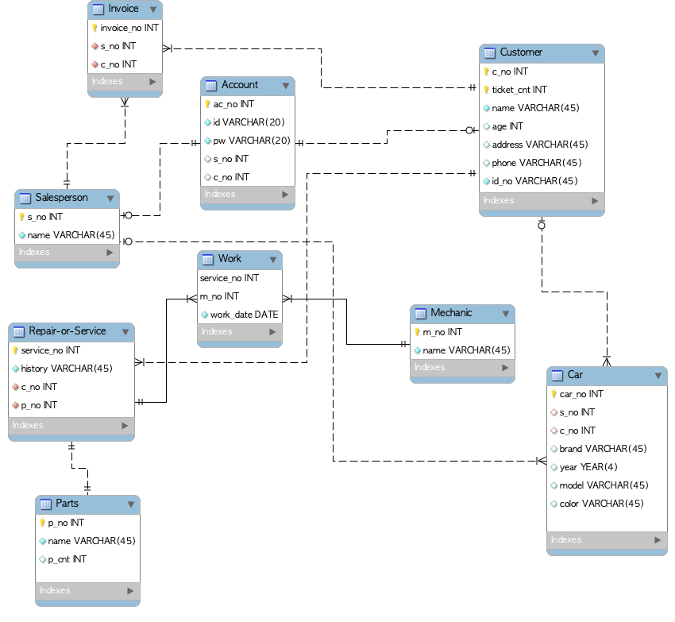

# 차량 구매 / 서비스 관리 프로그램  

## 개요  

고객으로 접속하여 차량 구매 혹은 서비스 신청  

판매자로 접속하여 고객, 차량, 주문 관리  

## 데이터베이스 모델링  

## 이슈  

* ~~파이썬 컨테이너 실행시 꺼지는 문제~~  

  * tail -f /dev/null 로 해결  

* ~~Docker exec -it <컨테이너 id> /bin/bash로 접속 시 파이썬 프로젝트 실행 불가 문제~~  

  * python 이미지 빌드 시 프로젝트 실행 명령어를 ~/.bashrc에 추가함으로써 해결  

## 추가 개선 사항  

* ~~app, db 두 개의 Dockerfile을 빌드하고 태깅, Docker Hub에 push 하는 과정 자동화하기~~  

* ~~위 과정 수행 시 프로젝트 전체 소스코드를 Github에 push 자동화하기~~  
