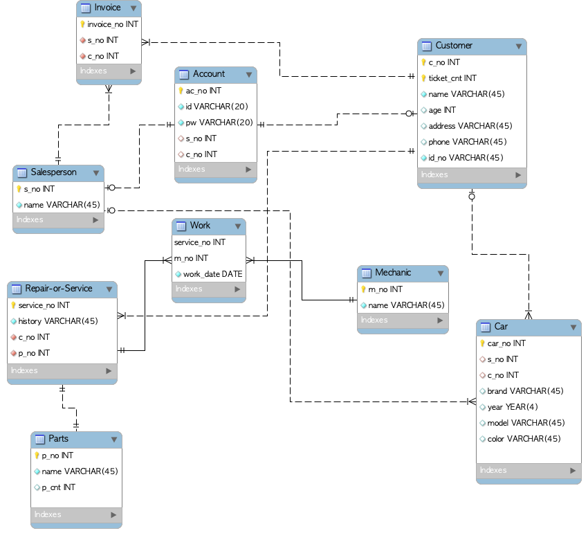

# 차량 구매 / 서비스 관리 프로그램  

## 개요  

고객으로 접속하여 차량 구매 혹은 서비스 신청  

판매자로 접속하여 고객, 차량, 주문 관리  

## 데이터베이스 모델링  

## 기능적 요구사항(Functional Requirements)

### 추가 할 것

## 비기능적 요구사항(Non-Functional Requirements)  

### 배운 것을 적절히 활용하였나  

* Python  

* Docker  

  * docker-compose로 python 컨테이너, DB 컨테이너 서비스 실행  

  * 볼륨 마운트 기능으로 데이터는 로컬에 유지  

* Linux, Shell Script  

* Infrastructre as Code  

### 정확성

* 오류없이 잘 작동하는가  

### 파이썬 답게, OOP, Clean Code에 맞게 작성하였는가  

* 적절한 자료구조를 사용하였는가  

* 예외처리를 적절히 추가하였는가  

* 클래스 적절히 사용하였는가  

* 기능을 모듈화하였는가  

* 함수는 하나의 기능만을 수행하는가  

* typing 활용으로 인자와 반환값에 대한 정보를 잘 전달하여 보기 쉬운 코드로 작성하였나  

* docstring을 작성하여 함수에 대한 설명을 덧붙였는가  

* 모듈 파일과 Main 파일을 분리하여 패키지를 구성하였는가  

* 파일로 저장한 결과들은 output 폴더에 저장  

### 추가 기능을 구현하였는가  

* 추가로 구현할 사항 고려하기  

### 프로젝트 수행 시나리오  

1. git에서 프로젝트 풀해서 로컬에 다운받고,  

2. sh 파일의 명령어를 실행하여,  

3. 풀해온 프로젝트를 volume 마운트 시켜 컨테이너에서 프로젝트 실행  